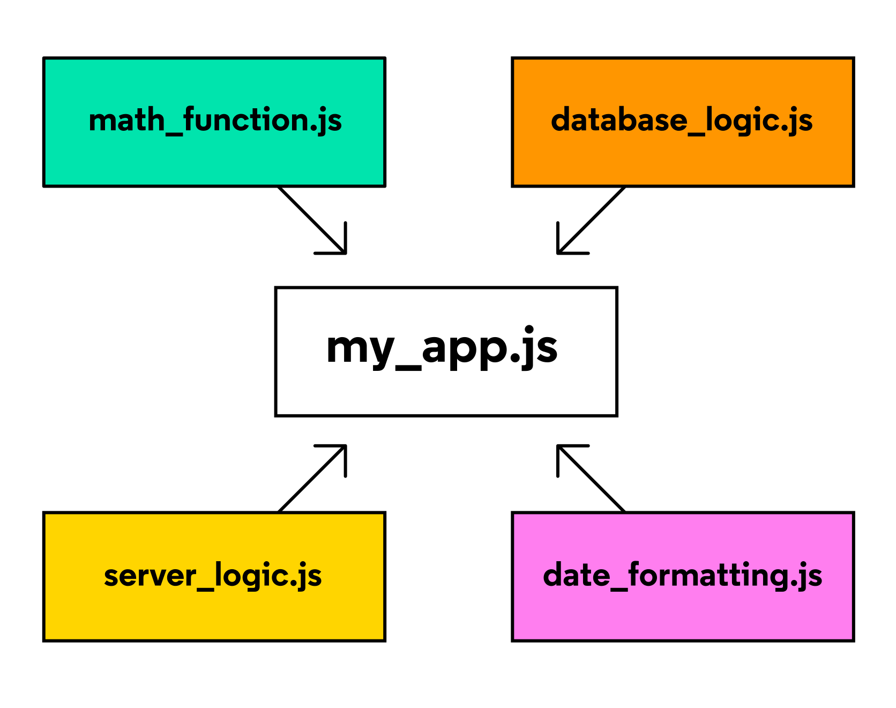

# Les modules

[Doc](https://developer.mozilla.org/en-US/docs/Web/JavaScript/Guide/Modules)

## Qu'est-ce qu'un module ?

Les modules sont des morceaux de code reutilisables dans un fichier qui peuvent etre exportes puis importes pour etre utilises dans un autre fichier. Un programme modulaire est un programme dont les composants peuvent etre separes, utilises individuellement et recombines pour creer un systeme complexe.

Considerons le schema ci-dessous d'un programme imaginaire ecrit dans un fichier `app.js`



Remarque : les mots "module" et "fichier" sont souvent utilises de maniere interchangeable

Au lieu d'avoir le programme entier ecrit dans `app.js`, ses composants sont divises en module distincts qui gerent chacun une tache particuliere. Par exemple, `database_logic.js` peut contenir du code pour stocker et recuperer des donnees d'une base de donnees Pendant ce temps, le module `date_formatting.js` peut conetnir des fonctions concues pour convertir facilement les valeurs de date d'un format a un autre

Cette strategie modulaire est parfois appelee "separation des preoccupations" et est utile pour un certain nombre de raisons

En isolant le code dans des fichiers separes, appeles modules, on peut :

- trouver, corriger et debooguer le code plus facilement
- reutiliser et recycler la logique definie dans differentes parties de votre application
- garder les informations privees et protegees des autres modules et
- eviter la pollution de l'espace de noms global et les collisions de noms potentielles, en selectionnant avec precautions les variables et le comportement que nous chargeons dans un programme

## Export

Nous creons dabord un module `mod.js`

```js
const toggleHiddentElement = element => {
    if(element.style.display == 'none') element.style.display = 'block';
    else element.style.display = 'none';
}

const changeToFunkyColor = element => {
    const r = Math.floor(Math.random() * 255);
    const g = Math.floor(Math.random() * 255);
    const b = Math.floor(Math.random() * 255);
    
    element.style.background = `rgb(${r}, ${g}, ${b})`;
}

export { toggleHiddentElement, changeToFunkyColor }
```

En plus de la syntaxe ci-dessus, dans laquelle toutes les exportations nommees sont repertoriees ensemble, des valeurs individuelles peuvent etre exportees en tant qu'exportations nommees en placant simplement le mot cle `export` devant la declaration de la variable

```js
export const toggleHiddentElement = element => {
    
}

export const changeToFunkyColor = element => {
    
}
```

## Importation

Afin d'eviter l'erreur `Uncaught Syntax Error: Cannot use import statement outside a module` il faut rajouter l'attribut `type="module"` dans l'appel au script present dans le fichier `index.html`

```html
<script type="module" src="app.js"></script>
```

On peut ensuite importer le module sans problemes et utiliser ces nouvelles fonctions

```js
import { toggleHiddenElement, changeToFunkyColor } from './modules/module.js';
```

## Renommer les importations afin d'eviter des collisions de noms

Il est possible de renommer les importations afin d'eviter des collisions de noms

```js
import { greet as greetEspagnol } from './greeterEspagnol.js';
import { greet as greetFrancais } from './greeterFrancais.js';
```

## Exportation des valeurs par defaut

Jusqu'a present, les exemples presentes ont utilise la syntaxe d'exporation nommee, dans laquelle les ressources d'un module sont exportees individuellement par leur nom. Chaque module a egalement la possibilite d'exporter une seule valeur pour representer l'ensemble du module appele l'exportation par defaut. Souvent, mais pas toujours, la valeurs d'exportation par defaut est un objet contenant l'ensemble complet des fonctions et/ou des valeurs de donnees d'un module

La syntaxe d'exportation est la suivante

```js
const ressources = {
    valueA,
    valueB    
}

// export { ressources as default };
export default ressources;
```

## Importation des valeurs par defaut

La syntaxe d'importation des exportations est la suivante

```js
import importDesRessources form 'module.js';
const { valueA, valueB } = importDesRessources; // si l'export est un objet
```

On note que les accolades ont disparu de l'instruction d'importation.
